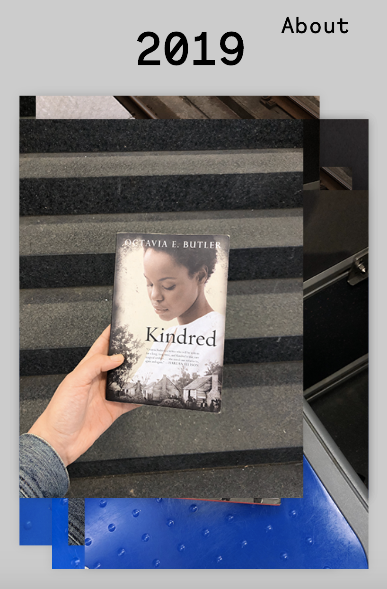

### Dan Reads MARTA 
> A visual collection of the books my partner read on Atlanta's public transit over the  years. Dan Reads MARTA represents the burning of a little less fossil fuels and the  making of a more active and informed citizen.


> Built with CSS, HTML, and Javascript. Responsible for all design and development from wireframe to site build.


## Challenges 


Ultimately, this was a way for me to practice building more things in Javascript. The biggest challenge was making the mouseover event responsive. The mouseover loops over each image and when the area is hovered over, the images move in lots of different ways. This is done by applying a mouseover event listener to the slideArea, looping through each image using a .forEach(), and applying a Math.random to the x and y axis. 

This was a pretty simple function when the screen width was greater than 768 px. On mobile, the random point on the x-axis was not constrained to the div containing the slideArray. I originally tried to solve the problem with media queries in CSS, but realized I would have to add an if/else statement in the mouseover eventListener. 

```javascript
slideArea.addEventListener("mouseover", () => {
    images.forEach(image => {
        let xTranslate;
        let yTranslate;
        const imageWidth = 400;
        if (screen.width <= 768) {
            const y = 25 * (Math.floor(Math.random() * 5)) -50;
            const maxXTranslateFromCenter = (screen.width * .8 - imageWidth) / 2;
            xTranslate = ((Math.floor(Math.random() * 5)) -2) / 2 * maxXTranslateFromCenter;
            yTranslate = y;
        } else {
            xTranslate = 20 * (Math.floor(Math.random() * 5)) -40;
            const y = 25 * (Math.floor(Math.random() * 5)) -50;
            yTranslate = y;
        }
        
        image.style.transform = `translate(${xTranslate}px, ${yTranslate}px)`
    })
});
```

The trick was creating a const 




Even harder than the code was taking the photos. Public transit has too much overhead flourescent lights to get good images on an iPhone. Working with ready-made assets is the way to go. 


## What's Next 
We're not driving anytime soon and Dan keeps reading so this project is ongoing. My goal is to add a backend so Dan could take ownership and take photos and update his progress. I would also like to add a interactive element that links the book photo to the book's page on [Indiebound](https://www.indiebound.org/).

## Author
[Aylor Brown](http://aylorbrown.com)